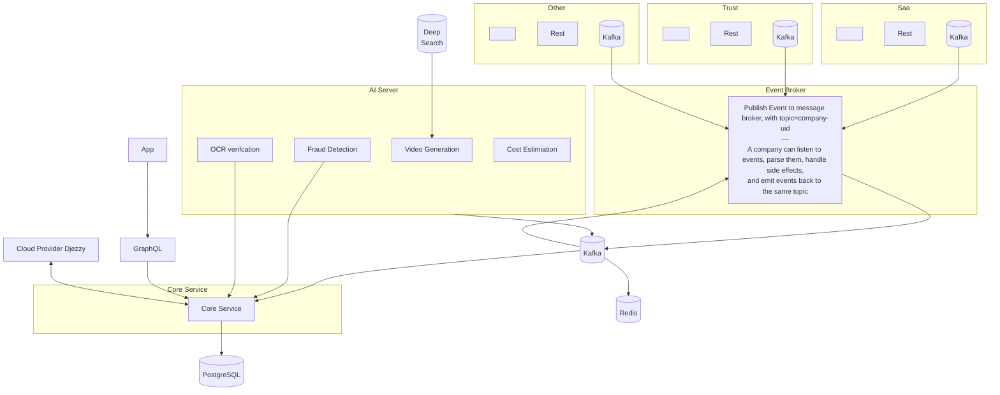
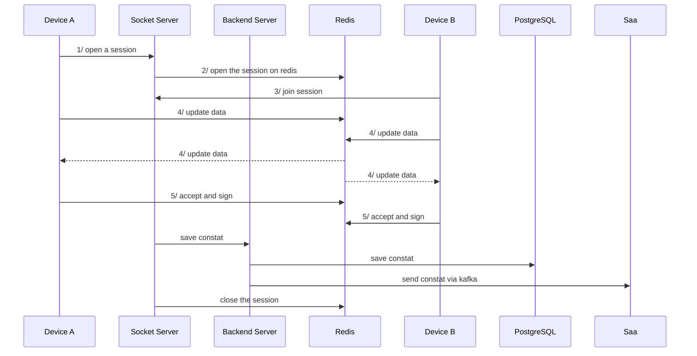

## Table of Contents

* [ High Level Architecture](#-high-level-architecture)
* [ Constat Session Management](#-constat-session-management)
* [Integration Module Architecture](#-integration-module-architecture)

## High Level Architecture

## Constat Session Management 

## Integration Module Architecture
for more details about this module, please refer to the [INTEGRATION_ARCHITECURE.md](INTEGRATION_ARCHITECURE.md) file.
